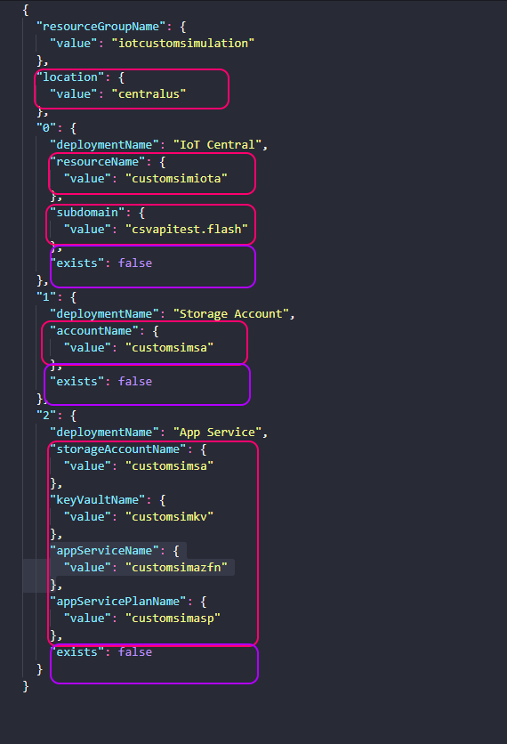

# Simulate Replay Data Devices from CSV files in Azure IoT Central

## Introduction
This repository contains the necessary start-up code to simulate IoT Devices in [Azure IoT Central](https://azure.microsoft.com/en-us/services/iot-central/) from pre-defined csv files, and it comes pre-packaged with sample simulated Energy and Power devices to facilitate getting started.

Deploying this repository is as easy as dragging and dropping your CSV & device model files in to the right folders, and running 1 python script. For ease of access, the script automatically provision all of the required resources on Azure to have a working secure solution without having to provide anything else.

Do note that by running this solution, the following resources will be created in your Azure Subscription:
1. Resource Group 
1. IoT Central Application
1. Storage Account
    * Blob Storage
    * Azure Table
1. App Service Plan
1. Azure Functions

If you already have any of the resources specified above, please follow the instructions in [Connecting Pre-Existing Azure Resources](#connecting-pre-existing-azure-resources).

## Getting Started
You will need the following items to run this solution:
1. Install [Python 3.7.1](https://www.python.org/downloads/release/python-371/)  
1. An Azure Subscription id
1. CSV Files to simulate Device Data with
1. Device Model JSON files to create the Devices from

To obtain an Azure Subscription id, visit the [Azure Portal](https://portal.azure.com) and search for `Subscriptions` in the search bar. Select a valid subscription from the list of available subscriptions and copy its corresponding id. You will need it in the steps below.

Once the id has been obtained, edit the `Deploy.py` file found in the same directory as this README and populate the `subscription_id` variable found at the top with this id. Optionally, you can enter the subscription id as a parameter when running the Deploy script as shown in the [Deploying Section](#Deploying).  

To obtain the Device Model files, you must either create those yourself by following the [Device Modeling Tutorial](https://docs.microsoft.com/en-us/azure/iot-central/tutorial-define-device-type-pnp?toc=/azure/iot-central-pnp/toc.json&bc=/azure/iot-central-pnp/breadcrumb/toc.json), or exporting the device models from your IoT Central Application.

#### Under the Hood
All resources will be deployed in to a resource group titled **iotcustomsimulation** under the subscription specified.

## Customizing your Deployment

#### Connecting Pre-Existing Azure Resources

Any pre-existing Azure Resource that you would like to reuse can be easily specified by navigating to the `default.params.json` file under the *Templates* folder in the current directory. 
In this file, you can edit any of the sections shown below to map them to your pre-existing resources. It is important that you do not change the numbering in these parameters, as that will provision the resources incorrectly.
If the resource already exists, please change the names to match those for which already exist, and change the value of "exists" in purple to `true`.

#### Plugging in your own csv files 
Customizing this solution requires the following actions:
1. Drop any device data csv files in to the *DeviceData* folder found under the *Data* folder in the current directory. 
1. Drop any device model files in to the *DeviceModels* folder found under the *Data* folder in the current directory.
1. Edit the `SimulateDevices.csv` file found under the *Data* folder in the current directory to define your device simulation requirements.
   * Following the already-provided data in this csv file will make this part a lot easier.
   

It is highly recommended to not attempt to simulate a scale larger than 10,000 devices, as this solution is not optimized for scaling.  
If you would like to simulate more than 10,000 devices for scale tests please contact the Azure IoT Central ORCA folks.

That's it! You're ready for deployment.

### Deploying 

After the above requirements have been met, open your favorite shell and run the following commands:
Note, this may take a long time as it is installing dependencies the project needs & deploying Azure resources.

`pip install -r requirements.txt`  
`python Deploy.py <subscription id>`